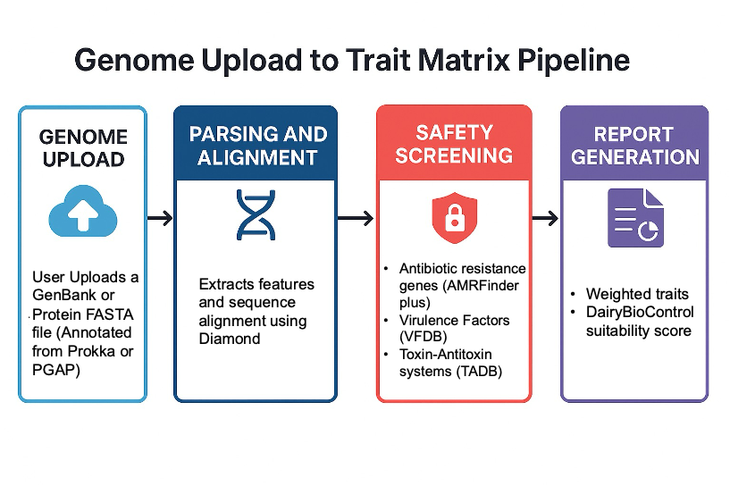

# 🧬 DairyBioControl

**DairyBioControl** is an integrated, next-generation web application for evaluating microbial genomes used in dairy fermentation and biocontrol.  
It combines **genome annotation parsing, trait detection, safety screening, and composite scoring** into a single interactive pipeline.

  

---

## 🚀 Features

- **Upload** annotated microbial genomes:
  - GenBank (`.gb`, `.gbk`, `.gbff`, `.genbank`) — PROKKA / PGAP recommended  
  - Protein FASTA (`.faa`)
- **Trait modules**:
  - 🛡️ Safety: ARGs (antibiotic resistance), virulence factors, toxin–antitoxin systems
  - 🥛 Dairy Adaptation: acid tolerance, salt tolerance, proteolysis, adhesion, EPS, probiotics
  - 🧫 Antibacterial traits: bacteriocins, siderophores, T6SS, phage defense
  - 🍄 Antifungal traits: lipopeptides (iturin/fengycin/surfactin), chitinases, antifungal volatiles
- **Outputs**:
  - Interactive graphs and tables per module
  - CSV downloads for summaries and detailed hits
  - Results tab with **Composite Biocontrol Potential Score (0–100)** normalized by database capacity and penalized by safety risks
- **Documentation tab** explaining methodology, scoring, and interpretation
- **User management**: registration, login, and inline verification (with optional SMTP email)

---

## 📊 Scoring System

The **Composite Biocontrol Potential Score** balances functional benefits against safety risks:

- **Per-trait evidence**:  
  Unique hits per subcategory, weighted (core = 1.0, supportive = 0.6).  
  Duplicates are de-duplicated by gene/product name.

- **Per-module benefit**:  
  Sum of trait evidences.

- **Risk indices**:  

